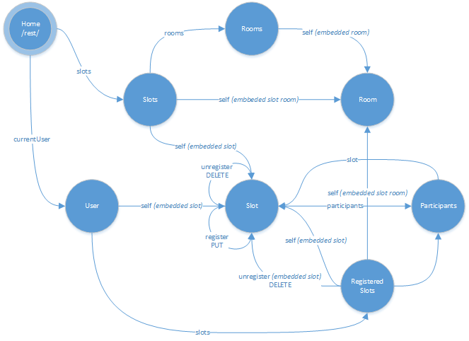
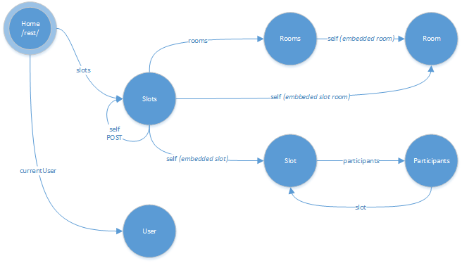

# Saxonia-Campus Hypermedia API

### Allgemeines

* Einstiegsadresse: *\<serverUrl\>*/rest/
* Response Media Types: application/hal+json
* Request Media Types: application/hal+json
* Authentifizierung: HTTP Basic

#### Beispiel-Request auf Einstiegsadresse

```
GET http://localhost:8180/rest/ HTTP/1.1
Authorization: Basic username:password
Accept: application/hal+json

HTTP/1.1 200 OK
Date: Sun, 18 May 2014 13:46:44 GMT
Content-Type: application/hal+json
Cache-Control: no-transform, max-age=300
Content-Length: 260

{
  "_links" : {
    "self" : {
      "href" : "http://localhost:8180/rest/"
    },
    "currentUser" : {
      "href" : "http://localhost:8180/rest/users/current"
    },
    "slots" : {
      "href" : "http://localhost:8180/rest/slots"
    }
  }
}
```

#### User API


#### Admin API

